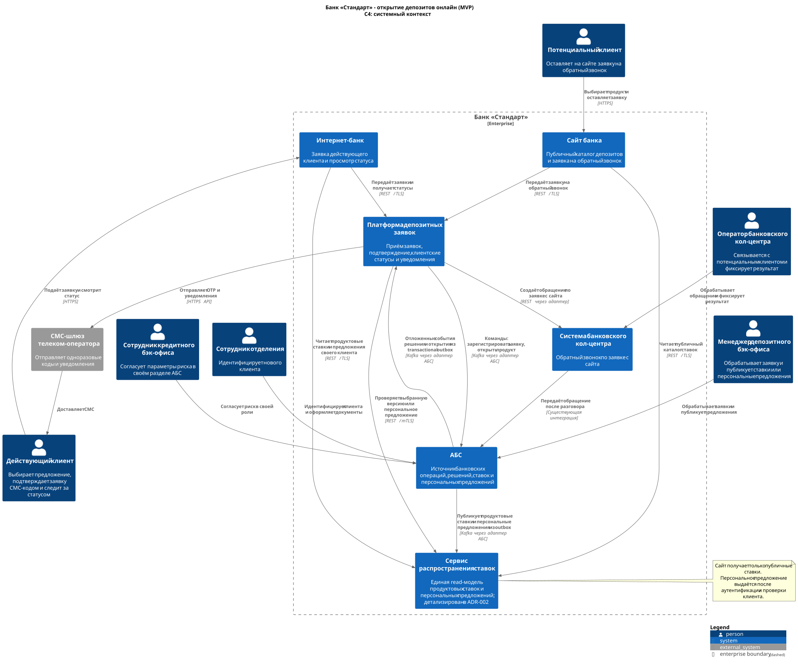
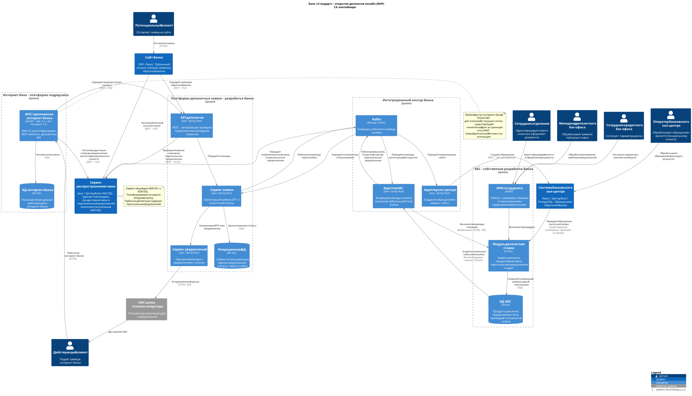

### **Название задачи:** Архитектура MVP открытия депозитов и накопительных счетов онлайн
### **Автор:** В. А. Бабнищев
### **Дата:** 05.08.2026
### **Статус:** принято для MVP

**Связанное решение:** [ADR-002](../Task4/ADR-002-передача-депозитных-ставок-в-кол-центры.md) уточняет этот ADR в части публикации и распространения ставок. После принятия ADR-002 отдельной витрины внутри платформы заявок нет: все каналы читают ставки из одного сервиса распространения.
### **Функциональные требования**

|**№**|**Действующие лица или системы**|**Use Case**|**Описание**|
| :-: | :- | :- | :- |
|1|Потенциальный клиент, сайт, сервис депозитных заявок, система кол-центра, АБС|Заявка нового клиента с сайта|1. Сайт получает из витрины список действующих депозитов и базовых ставок. 2. Клиент выбирает продукт, вводит Ф. И. О. и телефон, принимает условия обработки данных. 3. Сайт по защищённому соединению передаёт заявку сервису депозитных заявок. 4. Сервис валидирует данные, присваивает заявке идентификатор и сохраняет её. 5. Событие о новой заявке передаётся интеграционному адаптеру системы кол-центра. 6. Сайт показывает клиенту подтверждение приёма. 7. Оператор связывается с клиентом и фиксирует результат разговора. 8. Если клиент заинтересован, система кол-центра передаёт обращение в АБС по существующей интеграции. Для открытия продукта новый клиент проходит идентификацию в отделении.|
|2|Клиент интернет-банка, интернет-банк, сервис распространения ставок, сервис депозитных заявок, СМС-шлюз|Подача заявки действующим клиентом|1. Аутентифицированный клиент открывает раздел депозитов. 2. Интернет-банк передаёт внутренний идентификатор клиента сервису ставок и получает базовые ставки и действующие персональные предложения только этого клиента. 3. Клиент выбирает предложение, счёт списания и сумму. 4. Сервис заявок повторно проверяет предложение: клиента, продукт, диапазон суммы, срок действия и статус отзыва. 5. Сервис отправляет одноразовый код; клиент подтверждает операцию в пределах срока и числа попыток. 6. Сервис сохраняет заявку вместе с идентификатором и версией предложения, затем публикует команду на обработку. 7. Интернет-банк показывает номер и статус заявки.|
|3|Сервис депозитных заявок, Kafka, адаптер АБС, АБС, менеджер депозитного бэк-офиса|Обработка и открытие продукта в АБС|1. Адаптер получает команду из Kafka и идемпотентно регистрирует заявку через выделенный PL/SQL-интерфейс АБС. 2. Менеджер видит заявку в своём рабочем разделе АБС и принимает решение позже, независимо от первоначального вызова. 3. При подтверждении, отказе или открытии продукта PL/SQL-модуль сохраняет новый статус и запись исходящего события в одной транзакции Oracle. 4. Адаптер контролируемо читает outbox, публикует событие в Kafka и только после подтверждения брокера отмечает запись обработанной. 5. Сервис заявок идемпотентно применяет событие, обновляет клиентский статус и при необходимости ставит СМС в очередь. 6. Повторная публикация не создаёт второй продукт благодаря уникальному внешнему идентификатору заявки.|
|4|Сотрудники кредитного и депозитного бэк-офиса, АБС, сервис распространения ставок|Расчёт, согласование и публикация ставок|1. Сотрудник кредитного подразделения вводит расчётные параметры и результат оценки риска в своём разделе АБС. 2. Сотрудник депозитного подразделения формирует продуктовую ставку и период действия. 3. Для особого предложения он указывает клиента, продукт, допустимую сумму и срок действия; закрытые данные кредитного подразделения ему не раскрываются. 4. АБС не позволяет опубликовать несогласованную или пересекающуюся версию. 5. Публикация продуктовой ставки или персонального предложения фиксируется вместе с outbox. 6. Сервис распространения обновляет единую read-модель: публичный каталог доступен сайту, персональные предложения - только аутентифицированному интернет-банку.|
|5|АБС, сервис депозитных заявок, сервис уведомлений, СМС-шлюз, клиент|Информирование клиента|1. Подтверждение ставки и открытие продукта фиксируются в АБС вместе с событием outbox. 2. Адаптер доставляет событие через Kafka, а сервис заявок сохраняет новый статус и ставит уведомление в очередь. 3. Сервис уведомлений отправляет СМС через шлюз оператора. 4. Результат отправки журналируется; временная ошибка приводит к повторной попытке, но не откатывает банковскую операцию.|
|6|Клиент интернет-банка, интернет-банк, сервис депозитных заявок|Просмотр статуса|1. Клиент открывает список своих заявок. 2. Интернет-банк запрашивает статусы по идентификатору клиента. 3. Сервис возвращает только принадлежащие клиенту заявки и итоговые параметры. 4. Интернет-банк показывает текущий этап, требуемое действие и результат.|

### **Нефункциональные требования**

Численные показатели, которых не было в исходном описании, приняты как стартовые для оценки решения. Перед разработкой их нужно согласовать с владельцем продукта и эксплуатацией.

|**№**|**Требование**|
| :-: | :- |
|1|Интернет-банк и новые сервисы доступны не менее 99,9 % календарного времени в месяц. Отказ одного экземпляра приложения не должен останавливать приём заявок.|
|2|Предлагаемые показатели при отказе основного ЦОД: RTO не более 30 минут, RPO не более 5 минут. Stateless-компоненты развёртываются минимум в двух экземплярах, а восстановление проверяется на учениях.|
|3|Предлагаемый серверный SLO для чтения продуктов, ставок и статусов: до 500 мс для p95 и до 1 с для p99. Для приёма заявки - до 2 с для p95; последнее значение отдельно согласуется с владельцем продукта, потому что исходное пожелание сформулировано как отклик "в миллисекундах".|
|4|Новые онлайн-компоненты не читают БД Oracle АБС напрямую и не создают синхронную нагрузку на АБС. Базовые и персональные ставки читаются из единого сервиса распространения.|
|5|Доставка заявок и статусов - как минимум однократная с идемпотентной обработкой. Недоступность АБС или СМС-шлюза не приводит к потере принятой заявки.|
|6|Персональные и банковские данные шифруются при передаче TLS 1.2 или выше и в хранилищах. Персональное предложение выдаётся только после аутентификации и проверки соответствия идентификатора клиента; публичный API и партнёрские выгрузки таких данных не содержат.|
|7|Сотрудники депозитного и кредитного подразделений работают в раздельных ролях АБС. Согласование не раскрывает каждой стороне закрытые данные другой стороны.|
|8|Изменения заявки и ставки, проверки СМС-кода, действия сотрудников и технические повторы записываются в защищённый от корректировки аудит с единым correlation ID. Персональные данные в технических логах маскируются.|
|9|Stateless-компоненты допускают горизонтальное масштабирование. АБС масштабируется вертикально; её защищают очередь, пакетная обработка и лимит параллельных запросов адаптера.|
|10|Для новых backend-компонентов выбраны Java/Spring Boot, MS SQL и Kafka. До начала реализации требуется выделить отдельную команду и дежурную смену: существующих Java-специалистов АБС недостаточно для круглосуточного сопровождения всего контура. Старый интернет-банк использует REST API, так как с Kafka несовместим.|
|11|REST API и события версионируются и документируются в OpenAPI и AsyncAPI. Для критичных интеграций обязательны контрактные тесты, метрики, трассировка и инструкции сопровождения.|
|12|Интерфейсы соответствуют дизайн-системе банка и требованиям доступности: клавиатурная навигация, масштабирование до 200 %, достаточный контраст и понятные сообщения об ошибках.|
|13|Новый клиент не открывает депозит дистанционно до очной идентификации. Сайт принимает только заявку на обратный звонок и минимально необходимый набор персональных данных.|
|14|Заявки и бизнес-аудит хранятся 5 лет после завершения процесса, технический аудит интеграций - 1 год, оперативные логи - 90 дней. Значения являются проектными и до запуска подтверждаются ИБ, юристами и владельцем данных.|

### **Решение**

Процесс онлайн-заявки выносится из монолита интернет-банка в отдельный депозитный контур. Интернет-банк и сайт отвечают за пользовательские формы, а состояние заявки и переходы между этапами ведёт сервис заявок. Он принимает запросы по REST, хранит факт приёма и клиентский статус в MS SQL, а команды для АБС публикует в Kafka. Благодаря этому пользователь быстро получает номер заявки, а кратковременная недоступность АБС не блокирует онлайн-канал.

Ограничение относится именно к новому депозитному процессу. Существующий прямой доступ интернет-банка к БД АБС для платежей и текущих счетов остаётся как технический долг и не меняется в рамках шестимесячного MVP.

АБС остаётся системой учёта банковского продукта, решения сотрудника, открытого счёта и проводок. В ней дорабатываются очередь рабочих заявок, справочник ставок, персональных предложений и ролевой процесс согласования. Персональное предложение содержит внутренний идентификатор клиента, продукт, диапазон суммы, ставку, период действия и статус. Оно появляется в интернет-банке только после публикации и никогда не попадает в публичный каталог.

Входящие команды адаптер АБС получает из Kafka и передаёт в выделенный PL/SQL-интерфейс с ограничением параллелизма. Обратный поток устроен отдельно. Когда сотрудник позже меняет решение или открывает продукт, PL/SQL-модуль в той же Oracle-транзакции записывает событие в outbox. Адаптер читает outbox небольшими порциями, публикует событие в Kafka и отмечает его только после подтверждения брокера. Поэтому решение не теряется между Oracle и Kafka; возможный повтор снимается inbox-проверкой у потребителя.

Единственная read-модель ставок находится в сервисе распространения, описанном в ADR-002. Сайт читает из него только публичный каталог. Интернет-банк после аутентификации получает ещё и предложения своего клиента, а сервис заявок перед регистрацией повторно проверяет выбранное предложение. Платформа заявок не хранит вторую витрину, а сохраняет в заявке только использованные идентификатор и версию. СМС-коды и уведомления отправляет банковский сервис уведомлений через действующий шлюз оператора.

Сервисы развёртываются в инфраструктуре банка в основном и резервном ЦОД: stateless-экземпляры стоят за балансировщиком, MS SQL использует репликацию и контролируемое переключение, Kafka - репликацию сообщений. Топология между ЦОД уточняется на инфраструктурном проектировании и проверяется испытанием отказа. Для синхронных вызовов задаются таймауты и circuit breaker, для событий - повторная доставка и очередь ошибок. Состояние заявки восстанавливается по собственной БД, а не по пользовательской сессии.

Система кол-центра получает заявки с сайта через собственный адаптер. В интеграцию передаётся только необходимый набор данных, а операции помечаются единым идентификатором. После разговора оператор использует существующий канал системы кол-центра в АБС. Новый клиент всё равно проходит идентификацию в отделении; дистанционное открытие продукта для него в MVP не предусмотрено.

В реализации участвуют команды интернет-банка, сайта и АБС, новая Java/Kafka-команда, подрядчик системы кол-центра, инфраструктура, информационная безопасность и телеком-оператор. До старта нужно назначить владельцев сервисов и дежурства; это отдельное условие плана, а не задача "между делом" для нескольких разработчиков АБС. Изменение ядра интернет-банка не планируется: его MVC-приложение получает только REST-клиенты новых API.

Диаграммы являются частью решения:

-  показывает клиентов, сотрудников, границы банка и внешние системы ([исходник PlantUML](C4-context-online-deposits.puml)).

-  детализирует интернет-банк, сервисный контур и АБС, включая единый сервис ставок и обратный outbox-поток ([исходник PlantUML](C4-container-online-deposits.puml)).

### **Альтернативы**

1. **Доработать только монолит интернет-банка и сохранить прямой доступ к Oracle АБС.** Вариант требует меньше новых компонентов, но усиливает известную проблему нагрузки, связывает релиз с подрядчиком, не обеспечивает независимого масштабирования и оставляет онлайн-канал зависимым от доступности АБС. Отклонён.
2. **Вызывать синхронный API АБС непосредственно из интернет-банка.** Безопаснее прямого SQL, но время ответа и доступность клиентского сценария определялись бы перегруженной АБС. Прямое синхронное обращение также противоречит условию задания. Отклонён.
3. **Перевести весь интернет-банк на микросервисы до запуска депозитов.** Это улучшило бы целевую архитектуру, но несоразмерно шестимесячному MVP, повышает миграционный риск для действующих платежей и требует широкой зависимости от подрядчика. Отложено; выделенный депозитный контур служит первым шагом постепенной декомпозиции.
4. **Хранить ставки в отдельном новом сервисе как в системе-источнике.** Упростило бы чтение, но разорвало бы согласование ставок и учёт банковской операции, уже находящиеся в АБС. Выбрана витрина для чтения, а владельцем ставки остаётся АБС.
5. **Использовать только синхронный REST между всеми компонентами.** Проще в сопровождении на старте, но не поглощает пики, переносит сбои АБС на клиента и усложняет гарантированную доставку. REST оставлен на границе старого интернет-банка, внутри процесса выбран Kafka.

**Недостатки, ограничения, риски**

- Временная согласованность: после решения сотрудника статус в интернет-банке и витрина ставок обновляются не мгновенно. Компенсация - версия данных, отметка времени и мониторинг задержки событий.
- Kafka, новая БД и несколько сервисов увеличивают эксплуатационную сложность. До промышленного запуска нужны владельцы, мониторинг, инструкции, резервное копирование и обучение дежурной смены.
- Exactly-once для сквозного процесса недостижим без общей транзакции. Решение опирается на идемпотентность, outbox/inbox и уникальный внешний идентификатор заявки.
- АБС остаётся вертикально масштабируемым узким местом. Очередь защищает её от пиков, но может увеличить время ручной обработки; нужны лимиты, приоритеты и контроль отставания.
- Заявленная работа между ЦОД зависит от фактических возможностей сетевой инфраструктуры и лицензий MS SQL. RTO/RPO должны быть подтверждены испытанием, а не только конфигурацией.
- На период перехода Excel-файлы со ставками могут расходиться со справочником АБС. Перед запуском требуется разовая сверка, назначение владельца данных и прекращение публикации ставок из Excel.
- Обработка персональных данных на сайте расширяет периметр защиты. До запуска обязательны моделирование угроз, проверка формы согласия, тестирование безопасности и исключение ПДн из логов.
