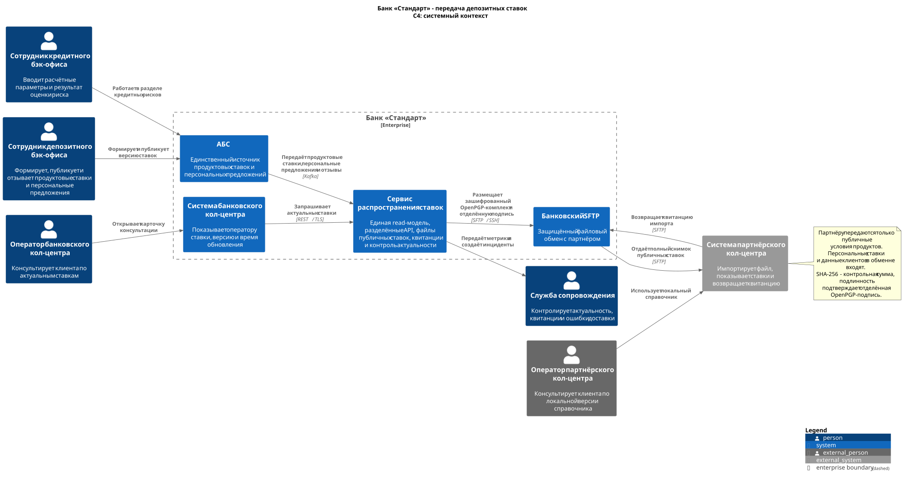
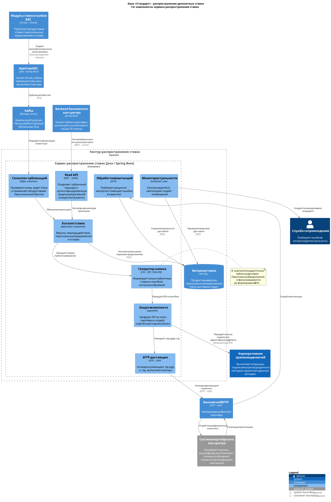
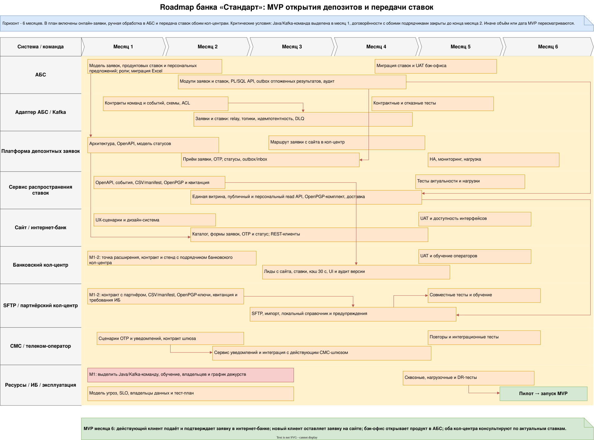
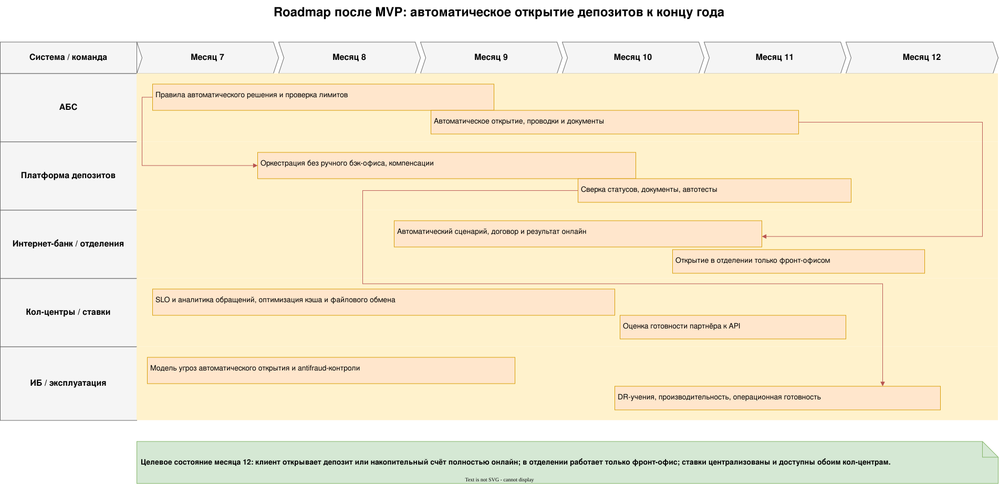

### **Название задачи:** Передача актуальных депозитных ставок в банковский и партнёрский кол-центры
### **Автор:** В. А. Бабнищев
### **Дата:** 05.08.2026
### **Статус:** принято для MVP

**Связанное решение:** этот ADR уточняет [ADR-001](../Task3/ADR-001-открытие-депозитов-онлайн.md) и заменяет предложенную там локальную витрину ставок. После принятия решения сервис распространения становится единственной read-моделью для сайта, интернет-банка и обоих кол-центров; владельцем исходных ставок и персональных предложений остаётся АБС.
### **Функциональные требования**

|**№**|**Действующие лица или системы**|**Use Case**|**Описание**|
| :-: | :- | :- | :- |
|1|Сотрудники кредитного и депозитного бэк-офиса, АБС, сервис распространения ставок|Согласование и публикация новой версии ставок|1. Сотрудник кредитного подразделения вводит расчётные параметры и результат оценки риска в своём разделе АБС. 2. Сотрудник депозитного подразделения формирует продуктовые ставки и период действия, используя доступный результат согласования. 3. АБС проверяет обязательные поля, полномочия и отсутствие конфликтующих периодов. 4. После публикации АБС фиксирует версию и запись outbox в одной транзакции. 5. Сервис распространения ставок атомарно обновляет витрину и запускает доставку потребителям.|
|2|Оператор банковского кол-центра, система кол-центра, API ставок|Консультация по актуальным ставкам|1. Оператор открывает карточку консультации. 2. Backend системы кол-центра запрашивает опубликованные ставки через внутренний REST API. 3. API возвращает продукты, ставки, сроки, ограничения, номер версии и время актуальности. 4. Интерфейс показывает данные оператору и предупреждает, если версия просрочена. 5. В обращении фиксируются использованные версия ставок и время консультации.|
|3|Сервис распространения ставок, банковский SFTP, система партнёрского кол-центра|Передача ставок партнёру|1. Сервис формирует CSV и `manifest.json` с версией схемы и SHA-256 контрольной суммой CSV. 2. Файлы упаковываются в ZIP, архив шифруется открытым OpenPGP-ключом партнёра, а зашифрованный файл подписывается отделённой OpenPGP-подписью банка. 3. Пара `.zip.pgp` и `.zip.pgp.sig` сначала загружается во временный каталог SFTP и только после завершения атомарно переносится в рабочий. 4. Партнёр проверяет подпись банка, расшифровывает архив своим закрытым ключом, проверяет SHA-256 и схему, затем целиком заменяет локальный справочник. 5. Партнёр размещает файл-квитанцию; банк сохраняет результат доставки.|
|4|Оператор партнёрского кол-центра, система партнёра|Консультация по ставкам|1. Оператор открывает локальный справочник ставок. 2. Система показывает последнюю успешно импортированную версию и время обновления. 3. При истёкшем сроке актуальности система запрещает озвучивать ставку как действующую и предлагает использовать согласованный резервный скрипт. 4. В обращении фиксируется версия справочника.|
|5|Сервис распространения ставок, служба сопровождения, ответственный сотрудник партнёра|Контроль актуальности и восстановление доставки|1. Сервис контролирует время последней публикации, выдачи по API и квитанции партнёра. 2. При ошибке выполняются ограниченные повторы без создания новой версии. 3. После исчерпания повторов инцидент и файл попадают в очередь ручного разбора. 4. Служба сопровождения видит причину, повторно отправляет тот же комплект или связывается с партнёром. 5. Все действия остаются в аудите.|
|6|АБС, сервис распространения ставок, потребители|Отзыв ошибочной версии|1. Ответственный сотрудник отзывает ошибочную версию в АБС и публикует корректирующую. 2. Сервис немедленно исключает отозванную версию из API. 3. Для партнёра формируется новый полный файл с признаком замены. 4. Банковский и партнёрский интерфейсы прекращают показывать отозванную версию после получения обновления.|

### **Нефункциональные требования**

Временные показатели ниже нужны для проектирования и тестов. Их следует утвердить вместе с кол-центрами до начала разработки.

|**№**|**Требование**|
| :-: | :- |
|1|АБС является единственным источником опубликованных ставок. XLS-файлы перестают использоваться как рабочий справочник после миграции и сверки.|
|2|API ставок и витрина доступны не менее 99,9 % календарного времени в месяц. Отказ АБС не прерывает чтение последней действующей опубликованной версии.|
|3|Предлагаемый серверный SLO API ставок - до 300 мс для p95 и до 700 мс для p99. Система банковского кол-центра кэширует успешный ответ не дольше 30 секунд и при недоступности API показывает последнюю действующую версию с отметкой времени.|
|4|Предлагаемые сроки распространения: банковский кол-центр получает новую версию в течение 1 минуты после публикации; файл партнёра размещается в течение 5 минут; квитанция ожидается 15 минут. После согласования эти значения становятся критериями приёмки.|
|5|Каждая версия ставок неизменяема, имеет уникальный номер, время публикации, период действия и признак отзыва. Потребители применяют файл только целиком; частичное обновление запрещено.|
|6|В файле партнёра отсутствуют персональные данные и персональные предложения. Передаются только публичные продуктовые условия, необходимые для консультации.|
|7|Внутренний API защищён TLS 1.2 или выше и сервисной аутентификацией. SFTP использует отдельную учётную запись партнёра, SSH-ключи, ограничение по IP и изолированный каталог. Файловый комплект шифруется OpenPGP на ключ партнёра и снабжается отделённой OpenPGP-подписью банка; SHA-256 используется только как контрольная сумма содержимого.|
|8|Повторная публикация одной версии идемпотентна. Файл сначала загружается под временным именем и становится видимым только после завершения передачи.|
|9|Аудит публикаций, сформированных комплектов, квитанций и ручных повторов хранится 5 лет; технические журналы интеграции - 1 год, оперативные логи - 90 дней. Это проектные сроки, которые до запуска подтверждают ИБ, юристы и владелец данных.|
|10|При отсутствии свежей версии оператор видит явное предупреждение. Просроченная или отозванная ставка не должна отображаться как действующая.|
|11|Формат API документируется OpenAPI, формат файла - версионированной схемой и примерами. Несовместимое изменение выпускается только новой major-версией после совместного теста с партнёром.|
|12|Компоненты сервиса распространения ставок горизонтально масштабируются, а обработка публикации использует Kafka и outbox/inbox для гарантированной доставки.|

### **Решение**

В АБС создаётся версионируемый справочник ставок. Сотрудники кредитного и депозитного подразделений работают в разных ролях: первые передают расчётные параметры и результат оценки риска, вторые формируют продуктовые условия и публикуют согласованную версию. Наружу изменение попадает только после публикации. В этот момент PL/SQL-модуль в одной транзакции сохраняет версию и запись outbox, а Java-адаптер передаёт событие в Kafka. Потребители поэтому не опрашивают перегруженную Oracle-БД и не видят незавершённых изменений.

Сервис распространения ставок на Java/Spring Boot потребляет события и хранит денормализованную витрину в MS SQL. Внутри него выделены компоненты: consumer публикаций, каталог ставок, внутренний REST API, генератор файлов, SFTP-доставщик, обработчик квитанций и монитор актуальности. Все обработчики идемпотентны по номеру версии. Витрина не является вторым владельцем данных: она содержит только опубликованные представления, которые можно восстановить из АБС и журнала событий.

Система банковского кол-центра получает ставки через внутренний read-only API. Интеграция выполняется в backend, поэтому браузер оператора не получает технических учётных данных. Кэш на 30 секунд сглаживает пик звонков и не нарушает минутный срок обновления. Ответ содержит номер версии и период действия; именно эта версия сохраняется в обращении.

Для партнёра выбран файловый канал через SFTP, поскольку его система не поддерживает API. Передаётся полный снимок: небольшой справочник проще целиком заменить, чем восстанавливать цепочку пропущенных изменений. CSV и `manifest.json` с версией схемы и SHA-256 упаковываются в ZIP. Архив шифруется открытым OpenPGP-ключом партнёра; полученный `.zip.pgp` подписывается закрытым подписывающим ключом банка, а отделённая подпись передаётся файлом `.sig`. SHA-256 здесь только обнаруживает повреждение CSV после расшифрования и не подменяет электронную подпись.

Подписывающий ключ банка хранится в корпоративном хранилище и не передаётся генератору файлов: компонент отправляет хэш на операцию подписи по идентификатору ключа. Закрытый ключ расшифрования находится у партнёра. В контракте фиксируются идентификаторы ключей, ответственные, отзыв, ежегодная ротация и период перекрытия старого и нового ключа не менее 30 дней. Партнёр сначала проверяет подпись, затем расшифровывает архив и сверяет manifest. Рабочие имена файлы получают только после полной загрузки. Квитанция содержит номер версии, идентификатор ключа и результат импорта; её отсутствие считается ошибкой доставки.

Общий сервис используется и онлайн-каналами из ADR-001. Он хранит две логические проекции: опубликованные продуктовые ставки и персональные предложения с идентификатором клиента и сроком действия. Сайт и кол-центры читают только публичную проекцию. Интернет-банк получает персональные предложения через отдельный аутентифицированный маршрут, который проверяет соответствие клиента. В партнёрский файл персональные предложения не попадают. На переходном этапе АБС сверяется с последним утверждённым Excel-файлом; после подписанной сверки Excel выводится из рабочего процесса.

Диаграммы являются частью решения:

-  показывает границы банка, операторов и партнёра ([исходник PlantUML](C4-context-rate-distribution.puml)).
-  детализирует только сервис распространения ставок; АБС, Kafka, кол-центр и SFTP показаны как внешние зависимости ([исходник PlantUML](C4-component-rate-distribution.puml)).

Крупные работы по затрагиваемым системам вынесены в файл [Крупные задачи по системам](Крупные-задачи-по-системам.md). Исходная двухстраничная схема находится в [RoadMap банка "Стандарт"](RoadMap_bank_Standart.drawio). Для просмотра без draw.io экспортированы обе страницы:

- 
- 

### **Альтернативы**

1. **Продолжить рассылку Excel по электронной почте обоим кол-центрам.** Почти не требует разработки, но не даёт контролируемой актуальности, машинной валидации и подтверждения загрузки; копии легко расходятся. Отклонён.
2. **Дать банковской системе кол-центра прямой доступ к Oracle АБС.** Уменьшает число компонентов, но расширяет доступ к критичной БД, усиливает нагрузку и связывает доступность консультаций с АБС. Отклонён.
3. **Предоставить партнёру REST API через внешний контур.** Дал бы почти мгновенное обновление и единый контракт, но партнёр технически не готов выполнять API-вызовы; потребовались бы новый внешний периметр и двусторонняя интеграция. Отклонён для MVP, может быть пересмотрен после готовности партнёра.
4. **Размещать файл вручную сотрудником бэк-офиса.** Быстрее автоматизировать в начале, но сохраняет человеческую ошибку, не укладывается в SLO публикации и плохо аудируется. Допустимо только как аварийная процедура с двойным контролем.
5. **Передавать инкрементальные файлы.** Снижает объём трафика, но усложняет порядок применения и восстановление после пропуска. Для небольшого справочника ставок выбран полный снимок.
6. **Пусть система кол-центра сама забирает ставки из SFTP.** Унифицирует канал с партнёром, но увеличивает задержку для внутреннего пользователя и создаёт лишнюю файловую интеграцию там, где доступен REST. Для банковского кол-центра выбран API.

**Недостатки, ограничения, риски**

- Банковский и партнёрский кол-центры получают данные с разной задержкой. Номер версии, период действия и мониторинг квитанций делают расхождение обнаруживаемым, но не устраняют его полностью.
- Компрометация SFTP-ключа сама по себе не раскрывает ставки и не позволяет выдать подменённый файл за банковский, но остаётся основанием для немедленной блокировки канала. Содержимое защищено OpenPGP-шифрованием, происхождение - подписью банка; для SSH- и OpenPGP-ключей действуют отдельные процедуры отзыва и ротации.
- Форматы OpenPGP-комплекта, manifest и квитанции требуют раннего согласования с партнёром. Без обмена тестовыми ключами и совместного интеграционного теста канал не считается готовым.
- Если партнёр не реализует запрет просроченной версии, его оператор может сообщить неверную ставку. Контракт, тестовые сценарии, версия в интерфейсе и операционный контроль обязательны, но исполнение во внешней системе зависит от партнёра.
- АБС остаётся исходным узким местом публикации. При её недоступности консультации продолжаются по последней действующей версии, но новую ставку опубликовать нельзя.
- На переходе возможен конфликт между Excel и АБС. Нужны назначенный владелец ставки, дата прекращения старого процесса и акт сверки.
- Новый сервис, Kafka и SFTP требуют дежурного сопровождения, резервного копирования, контроля сертификатов и ключей. Это дополнительные постоянные затраты.
- Шестимесячный срок реалистичен только при выделении Java/Kafka-команды в первый месяц и согласовании изменений с обоими подрядчиками не позднее конца второго месяца. При срыве этих условий объём MVP или дата запуска должны быть пересмотрены.
